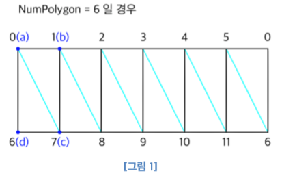
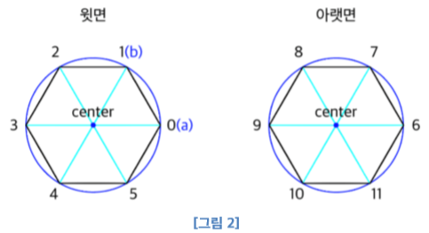
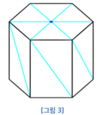
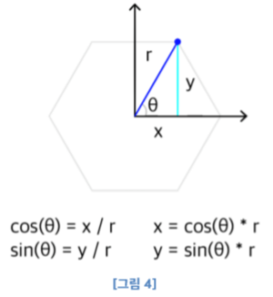
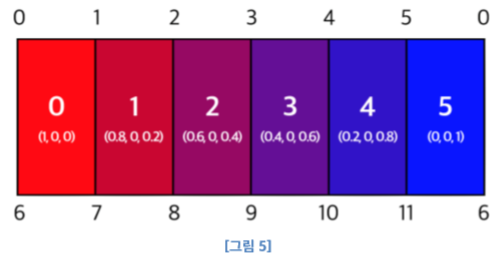
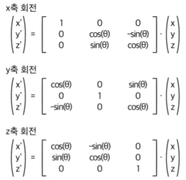
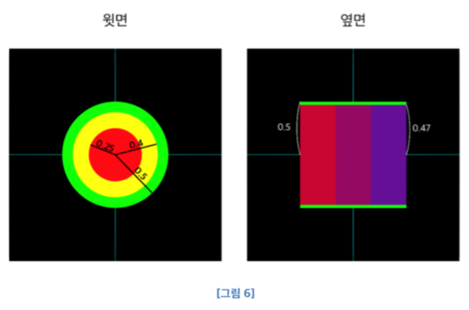

# Graphics-2-1  
Graphics2 Homework1: Rotating A Color Cylinder  
  
- Condition:  
  - Draw a color cylinder (create a “MyColorCylinder” class)  
  - Paint the cylinder like the example: 
    
  - Start Rotating when space bar is pressed
  - Increase or decrease the Number of Edges when pressing [1] or [2] key.
  - Stop when space bar is pressed again.
  - Quit when q or Q is presse
  
---
  
### MyColorCylinder  
MyColorCylinder 라는 클래스를 생성하여 실린더를 그리는데에 필요한 변수와 함수를 포함시켰다.  
멤버 변수에는 실린더의 윗면과 아랫면의 다각형이 몇각형인지를 기억하기위한 NumPolygon,  
실린더의 각각의 면들을 삼각형으로 쪼개서 그릴 때 몇개의 삼각형이 필요한지를 기억하는 NumTriangle,  
각각 쪼갠 삼각형들의 점의 수를 기억하는 NumVertex가 있고  
실린더의 윗면과 아랫면의 반지름을 통해 실린더 크기를 정하는 radius가 있다.  
Vshader에 실제로 보낼 point,  
color 정보들은 CylinderVertex라는 구조체 형식으로 동적 메모리 할당을 받는 vertices가 있고  
실제로 보내기 전 계산하기 위해 담아둘 vec4 형식의동적 메모리 할당을 받는 배열 vertex_pos, vertex_colors가 있다.  

### 생성자  
생성자에서는 변수들의 초기값을 결정한다.  
NumPolygon은 10, NumTriangle은 40, NumVertex는 120으로 초기값을 정했고,  
radius는 0.5로 정했으며 이 값은 프로그램이 실행되는 동안 따로 변하지는 않는다.  
Vertices, vertex_pos, vertex_colors는 동적할당을 받기 때문에  
나중에 지우고 다시 그릴 때 이미 한 번 사용이 됐는지 구분하기 위하여 초기값으로  NULL을 넣었다.  

### Init  
Init 함수에서는 colorcylinder함수를 불러와 가지고있는 point와 color 정보들을 vertices에 담는다.  
Vertex array와 Buffer를 만들고Buffer를 Binding한 후에 Buffer Data 하나를 보낸다.  
이 때 Buffer Data는 vertices를 보내는데, 동적할당을 했기 때문에 CylinderVertex 크기로 NumVertex 개수만큼 보낸다.  
Vshader와 fshader를 선언한 뒤 각각 데이터를 가져오는데  
vPosition은 맨 처음부터 정보를 가져오고 vertices가 vec4형식의 구조체이기 때문에  
다음에 가져오는 값은 vec4만큼의 offset을 갖는다.  
vColor는 vec4만큼 뒤에서부터 정보를 가져오며 vPosition과 마찬가지로 vec4만큼의 offset을 갖는다.  
이러한 과정이 잘 실행되면 bInit을 true로 저장한다. 

 
### Quad
  
Quad 함수는 점의 위치를 의미하는 값 a, b, c, d를 받아와  
a, b, c와 a, c, d의 삼각형으로 구분한 뒤 정보를 순서대로 vertices에 보낸다.  
이 때 그리는 사각형은 옆면에 있는 단색 면이므로 color값은 한가지인 a만 보낸다.  

### Triangle
  
Triangle 함수는 점의 위치를 의미하는 값 a, b와 radius값을 받아서 삼각형을 만들 정보를 순서대로 vertices에 보낸다.  
이 때 그리는 삼각형은 위쪽과 아래쪽에 있는 면이며 나머지 한 점은 다각형의 중심에 있다.  
이 중심 점(center)의 x, y값은 0이며 높이값 z는 앞서 결정된 실린더의 크기를 정하는 radius로 정한다.  
또한 이부분의 색은 fshader에서 칠할 것이므로 모두 똑같이 흰색값(1,1,1)을 보낸다.  
Colorcylinder함수는 quad와 triangle로 보내기위한 점들이 몇번째인지 계산한다.  
<그림 1>에서 위의 점 두개, 아래의 점 두개를 순서대로 보내야 하므로  
NumPolygon이 6일 경우 quad로 첫번째로 보내야 될 값은 (0, 1, 7, 6)  
즉, index가 0일 때 <b>(i, i+1, i+NumPolygon+1, i+NumPolygon)</b>이다.  
실린더의 옆면은 처음면과 마지막 면이 이웃해 있으므로 마지막 면은 (5, 0, 6, 11)가 되며  
이것은 곧 <b>index가 NumPolygon-1과 같아지는 때 (i, 0, NumPolygon, NumPolygon＊2 - 1)</b>이 된다.  
<그림 2>에서 서로 이웃한 점 2개와 z값을 보내야 하므로 NumPolygon이 6일 경우  
triangle로 첫번째로 보내야 될 값은 (0, 1, 0.5)즉, inde x가 0일 때 <b>(i, i+1, radius)</b>이다.  
랫면도 같은 순서대로 보내며 이 때 보내야 될 값은(6, 7, -0.5) 즉, <b>(i+NumPolygon, i+1+NumPolygon, -radius)</b>이다.  
Quad에서처럼 첫번째 삼각형과 마지막 삼각형은 서로 이웃해있기 때문에  
마지막 면은 (5, 0, 0.5)와 (11, 6, -0.5)가 되며 이 값은 <b>index가 NumPolygon-1과 같아지는 때  
(i, 0, radius), (NumPolygon＊2-1, NumPolygon, -radius)</b>가 된다.

### GenerateNPolygon  
  
함수는 실린더의 가장 기본적인 (그림을 그리기 위해 쪼개놓지않은) point, color정보를 생성한다.  
우선 main단에서 Num값을 NumPolygon에 저장한 뒤 NumTriangle과 NumVertex를 계산한다.  
[그림 3]처럼 윗면과 아랫면을 중심점을 기준으로 쪼개서 그리고 옆면은 사각형을 두개의 삼각형으로 쪼개서 그린다.  
따라서 필요한 삼각형의 갯수는 n＊2(옆면) + n(윗면) + n(아랫면) 즉 4n <b>(NumPolygon＊4)</b>이다.  
필요한 삼각형의 갯수가 4n 이므로 실린더를 그리는 데에 필요한 총 vertex의 수는  
삼각형 4n개의 각각의 점 3개씩이므로 12n <b>(NumPolygon＊12)</b>가 된다.  
Main에서 keyboadcallback으로 1키를 누를 때 다각형 각이 줄어들고  
2키를 누를 때 다각형 각이 늘어나므로 point, color정보를 저장하는 배열은 동적 메모리 할당을 받았다.  
키를 누르고, 다시 정보를 생성할 때를 위해 <b>메모리를 지우고 다시 할당</b>받는다. 

  
실린더의 vertex는 윗부분의 점과 아랫부분의 점으로 구성된다.  
NumPolygon값을 이용하여 dtheta를 구하고 돌아가면서 점을 하나씩 계산한다.  
dtheta는 360도를 NumPolygon으로 나눈 값이 되고 x, y값은 [그림 4]와 같이 삼각함수를 이용하여 계산한다.  
윗부분과 아랫부분의 점은 z값만 다르므로  
배열의 i번째 점은 윗면의 <b>(cos(dtheta＊i)*radius, sin(dtheta*i)＊radius, radius)</b>,  
배열의 i+NumPolygon번째 점은 아랫면의 <b>(cos(dtheta＊i)＊radius, sin(dtheta＊i)＊radius, -radius)</b>가 된다. 

  
실린더의 옆면은 NumPolygon개이며, 이 면을 각각 다른 색으로 칠하기 위해서는  
0부터 NumPolygon-1까지 NumPolygon개의 값이 필요하다.  
Float 형식으로 sidecolor라는 변수를 생성하여 각 면마다 얼마씩 차이를 두고 칠할지를 계산해서 저장한다.  
색상은 0에서 1로 표현되고 즉 sidecolor는 1.0 / (NumPolygon-1)이다.  
실제 색상값은 빨강에서 파랑으로 (1, 0, 0)에서 (0, 0, 1)로 변화하기때문에  
i번째 면일 때 (1(sidecolor＊i), 0, sidecolor＊i) 가 된다.  

### setTime  
함수는 input값을 uniform변수인 time에 저장한다.  

### Draw  
함수는 VertexArray를 다시 한 번 Binding하고 그림을 그린다.  

### Vshader  
  
에서 선형대수의 3차원 행렬 곱을 응용하여 객체를 x축, y축, z축으로 회전시켰다.  
이 때theta값인 uTime을 행렬 m1, m2, m3마다 1배, 2배, 3배로 설정하여  
과제 example과 같이 다양한 면이 모두 보이도록 회전하게 했다.  

### Fshader  
  
에서 옆면은 앞서 generate한 값 그대로 사용하고 윗면과 아랫면의 색을 결정한다.  
어느 한 점이 실린더의 윗면 또는 아랫면인지는 pos.z의 절댓값이 radius와 같은지를 통해 확인한다.  
즉, abs(pos.z) == 0.5이면 실린더의 윗면이거나 아랫면이다.  
반지름이 0.25보다 작으면 빨간색 (1, 0, 0),  
반지름이 0.25보다 크고 0.4보다 작을 때 윗면이면 노란색 (1, 1, 0),  
아랫면이면 흰색 (1, 1, 1),  
반지름이 0.4보다 큰 나머지는 녹색 (0, 1 ,0)으로 칠한다.  
이 때 pos.z가 0보다 크면 윗면, pos.z가 0보다 작으면 아랫면으로 판단한다.  
또한 과제 example에서 녹색인 부분을 잘 보면 옆면의 일부가 칠해져 있어  
반지름이 0.4 이상이고 pos.z가 0.47이상인 부분도 녹색으로 칠했다.  
  
  
---
  

### 문제  
키보드 입력을 받으면 time = 0인 화면이(실린더의 밑면이) 순간적으로 나오는 오류가 발생했다.  

### 원인  
Draw 함수에서 Printf를 이용해 time값을 출력해보니 time이 아예 0으로 초기화 되는 것이 아니라  
키보드를 누르는 순간에 0 이되었다가 다시 원래의 값으로 돌아갔다.  
좀더 구체적으로 어느 단계에서 0이 되는지 확인하기 위해 init 함수에서 함수를 선언하고  
VertexArray를 바인딩하는 등 모든 과정 사이사이에 Printf를 써서 확인해보니  
Buffer를 Generate하고 Binding할 때 순간적으로 0이 되고 Init함수를 빠져나갈 때 다시 원래의 값으로 돌아갔다.  
이 때 코드가 glGenBuffers(NumPolygon, &buf); 으로 되어있었는데  
이전에 동적으로 메모리를 할당 받는 부분을 고민하다가 바꿔본 코드에서 원복을 안한 상태로 계속 사용하고 있었다.  
버퍼를 너무 많이 생성했고 binding하기 전에 순간적으로 time이 0인 상태의 화면이 그려졌던 것이다.  

### 해결   
코드를 glGenBuffers(1, &buf); 로 수정하니 정상적으로 작동했다.  
또한 교수님께 질문을 통해서 그림을 다시 그릴 때는 myDisplay를 새로 호출하는 것이 아니라  
glutPostRedisplay(); 를 사용해야 한다는 점을 새로 알았다. 
 

